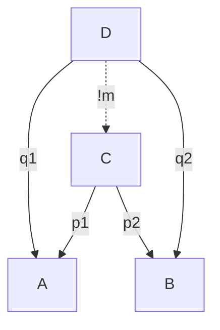
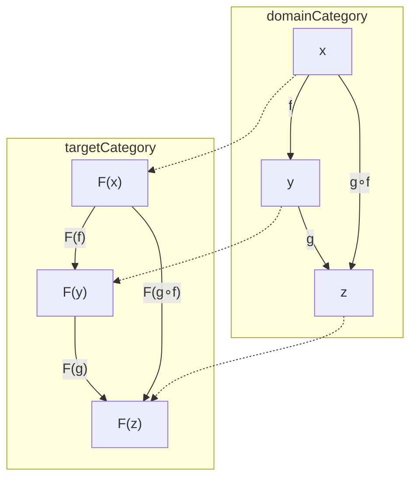

[toc]

Lecture Videos (Youtube): https://www.youtube.com/watch?v=I8LbkfSSR58&list=PLbgaMIhjbmEnaH_LTkxLI7FMa2HsnawM_
This note on Hackmd: https://hackmd.io/OkQvCLkHSmaizwJGSJCUUA

# 1. What is category

CATEGORY = (set of objects, set of morphisms)

EMPTY CATEGORY = (Empty set, empty set)

## Objects & Morphisms

In categort theory, objects is any thing in the objects set. Like nodes & arrows in graph, a morphism is a relationship from an object to an other object.

Objects in a category must have an **identity morphism**, an arrow started from itself toward itself.

Morphisms in category must be associative:
  - associative: $f, g, h$ are morphisms, $f \circ (g \circ h) = (f \circ g) \circ h$

## Some special morphisms

A morphism $f: x → y$ is **monomorphisms**
- if $f \circ g1 = f \circ g2$ implies $g1 = g2$ for all morphisms $g1, g2: z → x$.
- Monomorphisms has a **left inverse** if there is a morphism $g: y → x$ such that $g \circ f = id_x$.

A morphism $f: x → y$ is **epimorphism**
- if $g1 \circ f = g2 \circ f$ implies $g1 = g2$ for all morphisms $g1, g2: y → z$.
- Epimorphism has a **right inverse** if there is a morphism $g: y → x$ such that $f \circ g = id_y$.

A morphism $f: x → y$ is **isomorphism**
- if there exists a morphism $g: y → x$ such that $f \circ g = id_y$ and $g \circ f = id_x$.
- $g$ is called simply the **inverse** of $f$.

## Pure vs. Dirty Function

In programming, a pure function is a function that is stable from its input types to output types, it can not be effected by anything out of its scope and have no side effect outside its scope.


# 2. Some Categories

## Free Categories

A category is free category iff $∀$ morphisms $f, g$ , $(f \circ g)$ is also in its morphisms. Example: `funciton-composition.cpp`

## Monoid

Monoid is a kind of group that is simplest category
Monoid $(S, \cdot)$ has:

- A binary operation \dot
    + closed
    + associative
- The identity

The group $(Z^+_N, +)$ is a monoid where $Z^+_N$ is set of positive finite integers smaller than $N$, $N$ is a prime number, and $+$ is a binary operation of addition modulo N.

To see monoid as category:
- The singleton object $S$
- The morphisms are $a$, where $a \in S$
- The composition of morphisms: $a \cdot b$
- The identity morphism is the identity element


# 3. Kleisli Categories

Consider following function:

``` C++
std::string logger;
bool neg(bool b) {
    logger += "Neg!";
    return !b;
}
```

This function is not a pure function as it is not stable AND have side effect. To rewrite it as a pure function, we let the output type of function be an *embellished type* made of `bool b` and `string logger`:

``` C++
typedef pair<bool, string> bool_writer;
bool_writer neg(bool n) {
    return bool_writer(!n.first, "Neg!");
}
```

## Definition

We want to define a function composition operater that *chain up* our log strings together. There is a category out of it: Kleisli category:

- Let $m$ be a morphism that make the input/output of a function into *embellished type*.  
- $m$ is a part of so-called *monad*. (Detailed in latter chapter.)  
- Let f, g be morphisms in Kleisli Category:  
  - $f: t_1 → m(t_2)$
  - $g: t_2 → m(t_3)$
- The composition under Kleisli is $(g \circ f): t_1 → m(t_3)$

## Comparison table

Let's say there is a category $C$, object $x, y, z$ and two morphisms $f: x → y$ and $g: y → z$.

Their Kleisli counterpart over morphism $m$ are category $C_k$, object $x', y', z'$ and two morphisms $f': x' → y'$ and $g': y' → z'$.

| $C$        | $C_k$       |
| ---        | ---        |
| $m$        | $id_{X'}$  |
| $m \circ f$    | $f'$       |
| $m \circ g$    | $g'$       |
| $m \circ g \circ f$| $g' \circ f'$  |

### Example Code

`kleisli.cpp`


# 4. Initial, Terminal Object & Duality

## Initial and Terminal Object

- An object $i$ is a inital object in $C$ if for every object $x$ in $ob(C)$, there exists exactly one morphism $i → x$.
- An object $t$ is a terminal object in $C$ if for every object $x$ in $ob(C)$, there exists exactly one morphism $x → t$.  

Initial & terminal objects are *unique up to unique isomorphism*.

### Example

- The empty set is the unique initial object in *the category of sets*. Because there is exactly one empty function for each set, thus the empty function $\varnothing → x$ is not equal to $\varnothing → y$ if and only if $x \ne y$
- Every one-element set (singleton) is a *terminal object* in *the category of sets*.

## Opposite Category

$C_{op}$ of a given category $C$ is formed by reversing the morphisms, i.e. interchanging the source and target of each morphism.

## Duality

Given a statement regarding the category $C$, by interchanging the source and target of each morphism as well as interchanging the order of composing two morphisms, a corresponding dual statement is obtained regarding the opposite category $C_{op}$. In other words, if a statement is true about $C$, then its dual statement is true about $C_{op}$.

Applying duality, this means an *initial object* in a category $C$ is a *terminal object* the category $C_{op}$


# 5. Product & Coproudct

## Definition

A **product** of object $a$ and $b$ is a object $c$ equipped with two morphisms $p_1: c → a$ and $p_2: c → b$ satisfying the following universal property:
- For every object $d$ equipped with any pair of morphisms $q_1: d → a$ and $q_2: d → b$ there is a *unique* morphism $m: d → c$ such that $q_1 = p_1 \circ m$ and $q_2 = p_2 \circ m$. (We say that $m$ factorize $q_1$ and $q_2$)

```
 D (any product candidate)
    |        |         |
(q1)| (exist unique m) |(q2)
    v        v         v 
    A  <-p1- C -p2->   B 
```



We denote the product of $a$ and $b$ as $a \times b$

Whether a product exists may depend on the category or on $a$ and $b$. If it does exist, *it is unique up to canonical isomorphism*, so one may speak of *the* product.  
The product is the terminal object in the category of product candidates.

The morphisms $p_1$ and $p_2$ are called the **canonical projections** or **projection morphisms**.

## Examples of Product

The classic example of product is a **pair**. But to make a clearer example, let's say we want a class for the product of `int` and `bool`. This class `Product` will have two method:

``` C++
class Product {
    int toInt(); // Product -> int
    bool toBool(); // Product -> bool
}
```

How do we know whether a implementation of `Product` is the product of not? 

``` C++
class BadProduct {
    int data;
    int toInt() { return data; }
    bool toBool() { return true; }
}

class CounterBadProduct {
    int data1
    bool data2;
    int toInt() { return data1; }
    bool toBool() { return data2; }
    BadProduct toBadProduct(); // does not exist
}
```

Here, `BadProduct` is not a product of `int` and `bool`, because there is a `CounterBadProduct`. We expect for every instance `p` of `CounterBadProduct`, it holds that `p.toBool() == p.toBadProduct().toBool()`. But apparently it is not the case if `p.toBool() == false`.

``` C++
class BadProduct2 {
    int data1;
    int data2;
    bool data3;
    BadProduct2(int d1, int d2, bool d3) :
        data1(d1), data2(d2), data3(d3) {};
    int toInt() { return data1; }
    bool toBool() { return data3; }
}

class CounterBadProduct2 {
    int data1;
    bool data2;
    int toInt() { return data1; }
    bool toBool() { return data2; }
    BadProduct2 toBadProduct2() { // is not unique
        return BadProduct2(data1, /* can be any integer */, data2);
    }; 
}
```

In this case, there is `toBadProduct2()` such that, for every instance `p` of `CounterBadProduct2`, it holds that `p.toBool() == p.toBadProduct2().toBool()` and `p.toInt() == p.toBadProduct2().toInt()`. However, `toBadProduct2()` is not unique. So `BadProduct2` is not the product of `int` and `bool`.

``` C++
class PossibleProduct {
    int data1;
    int toInt() { return data1 / 2; }
    bool toBool() { return data % 2 > 0; }
}

class CounterPossibleProduct {
    int data1;
    bool data2;
    int toInt() { return data1; }
    bool toBool() { return data2; }
    BadProduct CounterPossibleProduct(); // could exist if int is a infinite set
}
```

If cardinality of `int` is infinite, then this `PossibleProduct` is a product of `int` and `bool`. However, in C++, cardinality of `int` is finite. So it can't be the product in this programming language, considering an instance `p` of `CounterPossibleProduct` where `p.toInt() == pow(2, 62)`.

## What is "unique up to isomorphism"

Unique up to isomorphism means that all the objects satisfying a given definition are isomorphic -- there must exist an isomorphism between those objects.  

if every isomorphism between those objects are unique, it is called **"unique up to *unique* isomorphism"**

### Why are they "unique"?

All isomorphic objects have the same relationship with other objects.   

Suppose $a \simeq b$ with isomorphism $α: a → b$, then for all object $y$, there are $Hom(a, y)$ and $Hom(b, y)$ and a bijection function $ϕ: Hom(a, y) → Hom(b, y)$.  

$Hom(a, y)$ means the set of all morphism from $A$ to $Y$

Because for all $f: a → y$ and $g: b → y$:
$$
\begin{aligned}
    ϕ(f) &= g = f \circ α^{-1} \\
    ϕ^{-1}(g) &= f = g \circ α \\
\end{aligned}
$$

we show that $ϕ^{-1} \circ ϕ: Hom(a, y) → Hom(a, y)$ is the identity function:

$$
\begin{aligned}
    (ϕ^{-1} \circ ϕ)(f) &= ϕ^{-1}(ϕ(f)) \\
    &= ϕ^{-1}(f \circ α^{-1}) \\
    &= f \circ α^{-1} \circ α \\
    &= f \circ id_a \\
    &= f \\
\end{aligned}
$$

Strictly speaking we should also show that $ϕ \circ ϕ^{−1}$ is also the identity function, but the proof is almost identical so we’ll omit it.

So we have shown that **there is a bijection between sets of morphisms of isomorphic objects**, and therefore they are formally of the same shape.

## Coproduct: Dual of Product 

Coproduct is basically the product with reverse direction of morphisms in the definition.

Let object $C$ be the product of object $A$ and $B$, the coproduct of $C$ is $C_{op}$ equipped with two morphisms $p_1: a → c$ and $p_2: b → c$ satisfying the following universal property:  
 - For every object $d$ and every pair of morphisms $q_1: a → d$ and $q_2: b → d$ there is a *unique* morphism $m: c → d$ such that $q_1 = (m \circ p_1)$ and $q_2 = (m \circ p_2)$. (We say that $m$ factorize $q_1$ and $q_2$)

We denote the product of $A$ and $B$ as $A \oplus B$

The programming counterpart of a coproduct is a **tagged-union**. Consider a structure `Either` that can be either a type A or type B but not both. We can implement it in this way:


``` C++
// The object Either is the coproduct of type A and type B
template <typename A, typename B>
class Either {
    private:
    enum {isLeft, isRight} tag;
    A left;
    B right;

    public:
    // mapping from A -> Either
    Either set(A a) {
        this.tag = isLeft;
        left = a;
    }

    // mapping from B -> Either
    Either set(B a) {
        this.tag = isRight;
        right = b;
    }

    // return defaultValue if Either is not type A currently
    A getLeft(A defaultVal) {
        return (this.tag == isLeft) ? this.left : defaultVal;
    }

    // return defaultValue if Either is not type B currently
    B getRight(B defaultVal) {
        return (this.tag == isRight) ? this.right : defaultVal;
    }
}
```

## Product and Coproduct as Algebra

A category and product/coproduct forms symmetric monoid.

Commutativity: it is pretty obvious that there existed a unique isomorphism from $a \times b$ to $b \times a$, which is $Swap()$.

Associativity: we can find an isomorphism from $a \times (b \times c)$ to $(a \times b) \times c$. To show that, consider the functions that turns $(a, (b, c))$ into $((a, b), c)$. Those functions exists and all have inverses.

Identity:
- For product, it is the terminal object $t$.
- For coproduct, it is the initial object $i$.

Let $b = a \times t$, $p: b → a$, and $u_b: b → t$. Because the uniqueness of ternimal morphisms $u_b$ is unique.

Considering $a$ itself as the product candidate with $id_a: a → a$ and $u_a: a → t$. We then have an unique morphism $m: a → b$. By the universal property of the product, $id_a = p \circ m$ and $u_a = u_b \circ m$.

Consider:

$$
\begin{aligned}
    u_a &= u_b \circ m \\
    u_a \circ p &= u_b \circ m \circ p \\
\end{aligned}
$$

since $u_a \circ p$ is morphism from $b → t$, it is unique, therefore $u_a \circ p = u_b$. We have:

$$
u_b = u_b \circ m \circ p \\
$$

By uniqueness of identity, $m \circ p = id_b$

Since $p \circ m = id_a$ and $m \circ p = id_b$. $p$ is an isomorphism. Thus $b \simeq a$.

In similar way, we can prove the identityness of initial object $I$ in coproduct operation.

Product is **distributive** with respect to coproduct. It makes the category equipped with product and coproduct a **semi-ring**.

In C++17 `std::optional<T>` is the coproduct of a initial object `nullopt_t` and the type `T`. We can write it in algebra as $optional(T) = 1 \oplus T$

In Haskell, the `List` type is recursively defined as:

```Haskell
data List x = Empty | x : (List x)
```

We can write down the difinition in algebra:

$$
\begin{aligned}
List(x) &= 1 + x \times List(x) \\
List(x) &= 1 + x \times (1 + x \times List(x)) \\
List(x) &= 1 + x \times 1 + x \times x \times List(x) \\
\vdots \\
List(x) &= 1 + x + x^2 + x^3 \cdots
\end{aligned}
$$

# 6. Functors

**Functor** is the mapping from category to category.

To map two categorys $C$ and $D$:
- Map the set of objects in $C$ to the set of objects in $D$
- Map the set of morphisms from $C$ to the set of morphisms in $D$, in the way that **structure is preserved**

For a functor $F: C → D$, for all $f: x → y$ and $g: y → z$ in $C$, it holds that:
1. $F(f): F(x) → F(y)$
2. $F(g \circ f): F(x) → F(z) = F(g) \circ F(f)$
3. $F(id_x) = id_{F(x)}$



**Functors are morphisms.** They can do compositions too. For categories $C, D, E$, if there are functor $F: C → D$ and $G: D → E$, we can have composed functor $H = G \circ F: C → E$.

Functors and categories make a **category of categories**.

## Special Functors


- **Faithful functor** is injective on the morphism sets
- **Full functor** is surjective on the morphism sets.
- **Constant functor** at $x$, denoted as $\Delta_X: C → D$, maps all objects from category $C$ to a fixed object $x \in D$ and maps all the morphisms to the identity morphism $id_x$.
- **Endofunctor** maps a category to itself.
- **Identity functor** maps category to itself and nothing is changed.
- **Contravariant functor** $F: C → D$ satisfies $F(g \circ f) = F(f) \circ F(g)$, in other words it, the second condition is reversed. We can write a contravariant functor in normal/covariant functor as $F: C_{op} → D$
- **Presheaf** on a category $C$ is a functor $F: C_{op} → \mathbf{Set}$

## Examples of functor in programming

### Function Mapper

Let say we have some functions that input and output numbers (`int`, `float`, `double`, etc.). But at certain point, we want these functions to work on numbers encoded as `string`. In this case, a functor to wrap the functions is useful. See example code: `functor.cpp`

### Safe `list::pop_front`

A standard C++ `list::pop_front` function has undefined behavior when the input list is empty. It is good that we return a `optional<list<T>>` object for safety. However, we don't want to re-write the functions working on `list` for `optional<list>`. We can simply write the functor `optionalized()` to transform the original function from category of `T` to the category of `optional<T>`.

``` C++
template <typename T>
std::optional<std::list<T>> safe_get_tail(std::list<T> list) {
    if (list.size() == 0)
        return std::nullopt;
    std::list<T> resultList(list);
    resultList.pop_front();
    return resultList;
}

template <typename T, typename U>
auto optionalized(T (*func)(U)) {
    return [func] (std::optional<U> input) {
        if (input)
            return func(input);
        return std::nullopt;
    }
}

double square_map(list<double> list) {
    std::list<double> resultList;
    std::transform(list.begin(),list.end(),resultList.begin(),
        [](double x) {return x * x;}
    );
    return resultList;
}

int main() {
    std::list<double> goodList = {1, 3, 5, 7, 9};
    std::list<double> emptyList = {};
    auto goodTail = safe_get_tail(goodList);
    auto emptyTail = safe_get_tail(emptyList);
    auto goodSquaredTail optionalized(square_map)(goodListTail);
    auto emptySquardTail optionalized(square_map)(emptyTail);
    return 0;
}
```

# 7.1 Bifunctors

A **bifunctor** is a functor
- from a **product category**
- to a category

### Product Category

Let there be two category $C, D$, the product of $C$ and $D$ contains all possible the pairs of objects and morphisms between $C$ and $D$, that is
- $ob(C \times D) = \{ (x, y) \mid x \in ob(C), y \in ob(D) \}$
- $mor(C \times D) = \{ (f, g) \mid f \in mor(C), g \in mor(D) \}$

The morphism composition works like vectors.

So a bifunctor takes the form of $F: C \times D → E$.

### Difinition

A bifunctor $F: C \times D → E$, for all morphism $(f_1, f_2): (x_1 → y_1, x_2 → y_2)$ and $(g_1, g_2): (y_1 → z_1, y_2 → z_2)$, it holds that
- $F(f_1, f_2): F(x_1, x_2) → F(y_1, y_2)$
- $F((g_1, g_2) \circ (f_1, f_2)): F(x_1, x_2) → F(z_1, z_2) = F(g_1, g_2) \circ F(f_1, f_2)$
- $F(id_{x_1}, id_{x_2}) = id_{F(x_1, x_2)}$


### Pair of Objects and Morphisms

The product or coproduct of every pair of object do not necessary exists. But if they do, we can construct a new category $C'$ that
- $ob(C') = \{ x \times y \mid x \in ob(C), y \in ob(D) \}$
- $mor(C') = \{ f \times g \mid x \in mor(C), y \in mor(D) \}$

Same with coproduct:
- $ob(C'_{op}) = \{ x \oplus y \mid x \in ob(C), y \in ob(D) \}$
- $mor(C'_{op}) = \{ f \oplus g \mid x \in mor(C), y \in mor(D) \}$

And there are obvious bifunctors $F': (C \times D) → C'$ and $F'_{op}: (C \times D) → C'_{op}$

### Wait... What is the Product and Coproduct of Morphism?

The product of morphisms $f: a → a'$ and $g: b → b'$, denoted by $f \times g$, is the unique morphism that

$$
f \times g: (a \times b) → (a' \times b')
$$

$f \times f'$ is unique because
- As the definition of product of objects says, object $(a \times b)$ has morphism $p: (a \times b) → A$ and $q: (a \times b) → b$
- We have composite morphisms $f \circ p: (a \times b) → a'$ and $g \circ q: (a \times b) → b'$
- The definition of product of objects also says that, for any object that has morphism to $a'$ and $b'$, there exists an unique morphism from that object to $a' \times b'$
- So, $(a \times b) → (a' \times b')$ is unique.

Similar proof goes with coproduct.

### Examples of Bifunctor in Programming

In Haskell, bifunctor looks like

``` haskell
class Bifunctor f where
    bimap (a -> a') -> (b -> b') -> (f a b -> f a' b')
```

The `Either` class, defined earlier in C++ to explain coproduct, is a bifunctor if it can be applied on functions

``` C++
// The object Either is the coproduct of type A and type B
template <typename A, typename B>
class Either {

    /* ... */

    // map two functions into one
    template <typename P, typename Q>
    auto either_do(
        P (*funcL)(A),
        Q (*funcR)(B)
    ) {
        return [funcL, funcR] (Either<A, B> input, A lDefault, B rDefault) {
            Either<P, Q> result;
            if (input.tag == isLeft)
                result.set(
                    funcL(input.getLeft(lDefault))
                );
            else
                result.set(
                    funcR(input.getRight(rDefault))
                );
            return result;
        }
    }
}
```

This bifunctor `Either`, maps function pair `P funcL(A)` and `Q funcR(B)` into `Either<P, Q> ()(Either<A, B>)`.

# 7.2 Monoidal Categories

A monoidal category $(C, \otimes, I)$ is consisting of
- A category $C$.
- A bifunctor $\otimes: C \times C → C$. (binary operation)
  - The $\otimes$ is called **tensor product**
  - $\otimes$ is *associative (up to natural isomorphism)*
- An unit object $e \in ob(C)$ such that $\forall a \in ob(C), (\otimes(e, a) \simeq a \land \otimes(a, e) \simeq a)$. (identity element)
- Three natural isomorphisms are involved
  - The associator
    - $α_{a,b,c}: \otimes(\otimes(a, b), c) → \otimes(a, \otimes(b, c))$
  - The left and right unitor
    - $λ_a: \otimes(e, a) → a$
    - $ρ_a: \otimes(a, e) → a$

We will write $\otimes(a, b)$ as $a \otimes b$ from now on.

## Example of monoidal categories

Let make a simple monoidal category from the category of C++ `string`. It has a simple bifunctor `concat`. The application of `concat` is to concatenate two strings. The unit object in this monoidal category should be a instance of string `e`, such that `Concat(e, x) == Concat(x, e)`. This instance of string is obviously an empty string. The implementation is in file `monoidalCategory.cpp`.

Note that, in the monoidal category of string concatenation, the morphism between strings are *permutations*.

# 7.3 Profunctor

